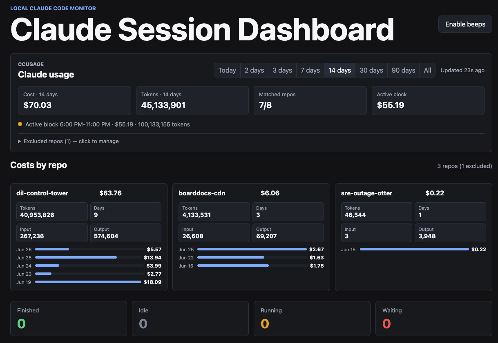
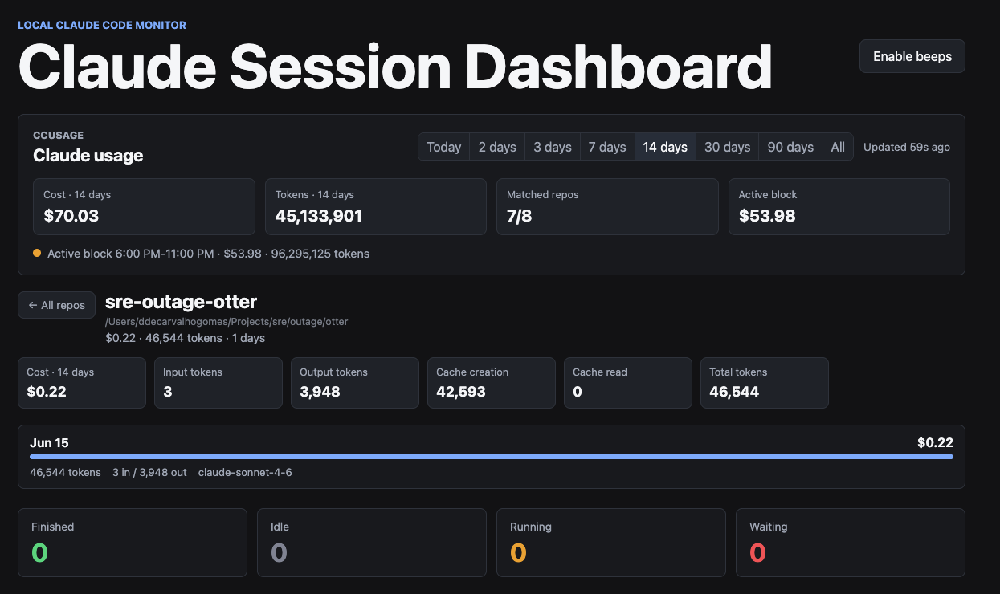
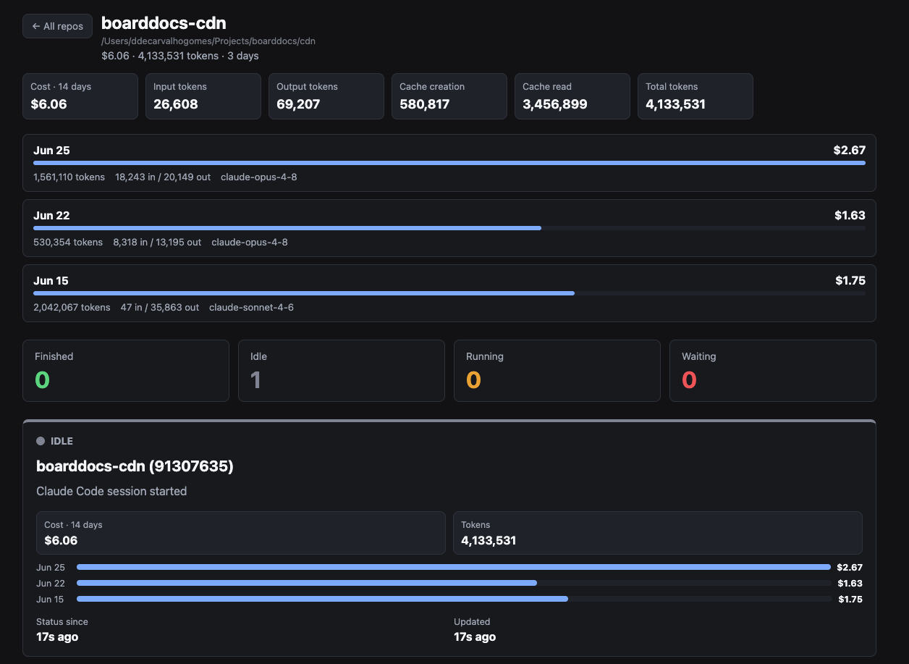

# Claude Status Dashboard

> **Real-time visibility into your Claude Code sessions — costs, statuses, and history at a glance.**

[](https://github.com/danielcg-net/claude_status_dashboard)
[](LICENSE)

Local-only web dashboard for tracking Claude Code sessions. Claude Code hooks register sessions and push status changes to the API exposed by the Docker container. The dashboard also reads Claude Code usage through [`ccusage`](https://www.npmjs.com/package/ccusage) and displays cost/token totals when Claude logs are available.

---

## Screenshots

| Active Sessions | Usage & Cost Explorer | Repo Cost Explorer |
|:---:|:---:|:---:|
|  |  |  |

---

## Statuses

| Color | Meaning |
|:---:|:---|
| 🟢 **Green** | Claude has finished running something. |
| 🟡 **Yellow** | Claude is idle at the prompt, waiting for your input. |
| 🟠 **Orange** | Claude is thinking and doing stuff. |
| 🔴 **Red** | Claude is paused waiting for an approval or decision. |

## Quick Start

### Docker Compose (recommended)

```bash
docker compose up --build
```

Open [http://localhost:8787](http://localhost:8787).

The app stores session state in memory. Restarting the container clears the dashboard.

By default, Compose mounts your host Claude Code config directory into the container:

```yaml
volumes:
  - "${HOME}/.claude:/claude:ro"
environment:
  CLAUDE_CONFIG_DIR: "/claude"
```

If your Claude Code logs live somewhere else, change the volume source and keep `CLAUDE_CONFIG_DIR` pointed at the mounted path.

---

## API

### Read ccusage totals

```bash
curl http://localhost:8787/api/usage
```

### Register or update a session

```bash
curl -X POST http://localhost:8787/api/sessions \
  -H 'Content-Type: application/json' \
  -d '{"id":"repo-main","name":"My project main worktree","usageProject":"my-project","status":"orange","detail":"Claude is running tests"}'
```

### Set a session status

```bash
curl -X PATCH http://localhost:8787/api/sessions/repo-main \
  -H 'Content-Type: application/json' \
  -d '{"status":"red","detail":"Waiting for tool approval"}'
```

### List sessions

```bash
curl http://localhost:8787/api/sessions
```

### Delete a session

```bash
curl -X DELETE http://localhost:8787/api/sessions/repo-main
```

> **`usageProject`** is optional. When present, the dashboard uses it to match the card to `ccusage daily --instances --json` project totals and display session cost on the card. If omitted, the browser tries to match the card `id` or `name` against the ccusage project key.
>
> To see available project keys:
> ```bash
> npx ccusage claude daily --instances --json
> ```

## Claude Code Hook

Sample global Claude Code hooks live in [hooks/](hooks/README.md).

Yes, these can be configured globally in `~/.claude/settings.json`; they do not need to be installed per repo. The sample hook reads Claude Code's hook JSON from stdin and updates the dashboard by `session_id`.

### Status Mapping

| Hook Event | Dashboard Status |
|:---|---:|
| `SessionStart`, `UserPromptSubmit` | 🟡 **yellow** (idle at prompt) |
| `PreToolUse`, `PostToolUse` | 🟠 **orange** (actively working) |
| `Notification` | 🔴 **red** (needs attention) |
| `Stop`, `SubagentStop` | 🟢 **green** (finished) |
| `StopFailure` | 🔴 **red** (error) |

---

## Claude Code Plugin

A Claude Code plugin package lives in [claude-code-plugin/claude-status-dashboard](claude-code-plugin/claude-status-dashboard/README.md). It bundles the same hook behavior with a `.claude-plugin/plugin.json` manifest and plugin `hooks/hooks.json`.

### Install from the GitHub marketplace

```bash
claude plugin marketplace add danielcg-net/claude_status_dashboard --scope user
claude plugin install claude-status-dashboard@claude-status-dashboard --scope user
```

### Local development

```bash
claude plugin marketplace add ./claude-code-plugin --scope user
claude plugin install claude-status-dashboard@claude-status-dashboard --scope user
```

---

## Red Alert Beeps

The browser can emit a quiet beep when any card remains **red** longer than `RED_ALERT_AFTER_MS`.

Browsers require a user gesture before audio can play, so click **Enable beeps** after opening the page.

Configure the default threshold in `compose.yml`:

```yaml
environment:
  RED_ALERT_AFTER_MS: "300000"
```

The page also has browser-stored controls for:

- `Start after`: how many seconds a card must remain red before beeping starts.
- `Stop after`: how many beeps play before stopping. Leave it blank for no limit.

---

## ccusage Integration

Usage metrics are refreshed through the server every `USAGE_CACHE_TTL_MS` milliseconds. The browser polls `/api/usage` every 30 seconds.

The app runs:

```bash
ccusage claude daily --json
ccusage claude daily --instances --json
ccusage claude blocks --json
```

If the installed `ccusage` version does not support the agent subcommand form, the adapter falls back to:

```bash
ccusage daily --json
ccusage daily --instances --json
ccusage blocks --json
```

If the usage panel says data is unavailable, check that the container can read Claude logs and that `CLAUDE_CONFIG_DIR` points to the mounted directory.

Each session card displays cost/tokens from the matched `ccusage --instances` project. The timeframe selector defaults to today and supports 2, 3, 7, 14, 30, 90 days, or all history. Cost summaries are always tied to the selected timeframe; cards also show the most recent non-zero daily costs for that window.

For the cleanest match, send `usageProject` from your hook using the exact project key reported by `ccusage`.

### Local Development

```bash
npm install
npm run dev
```

Then open [http://localhost:8787](http://localhost:8787).

---

## Publish Target

This repository is published at [danielcg-net/claude_status_dashboard](https://github.com/danielcg-net/claude_status_dashboard).
