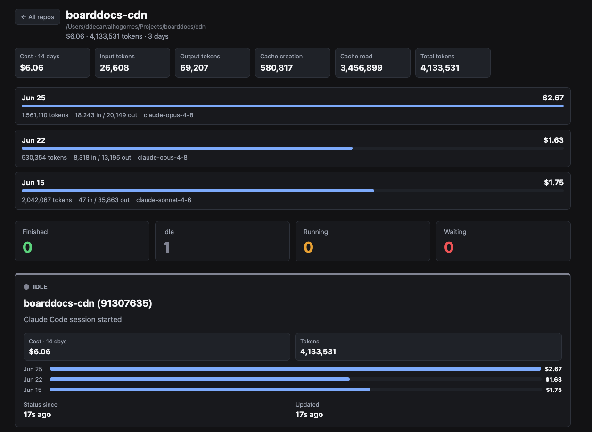
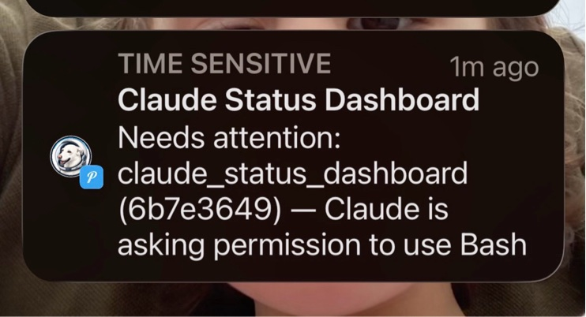

# Claude Status Dashboard

> **Real-time visibility into your Claude Code sessions — costs, statuses, and history at a glance.**

[](https://github.com/danielcg-net/claude_status_dashboard)
[](LICENSE)

Local-only web dashboard for tracking Claude Code sessions. Claude Code hooks register sessions and push status changes to the API. The dashboard also reads Claude Code usage through [`ccusage`](https://www.npmjs.com/package/ccusage) and displays cost/token totals when Claude logs are available.

---

## Screenshots

| Active Sessions | Usage & Cost Explorer | Repo Cost Explorer |
|:---:|:---:|:---:|
|  |  |  |



---

## Quick Start

**Prerequisites:** Node.js 18+, Claude Code CLI

### npx (recommended)

Run directly without installing anything:

```bash
npx claude-status-dashboard
```

### npm install

Or install globally and run:

```bash
npm install -g claude-status-dashboard
claude-status-dashboard
```

Open [http://localhost:8787](http://localhost:8787). The server starts on port 8787 (configurable via `PORT` env var).

> **Note**: The npm package ships the pre-built server — no `git clone`, Docker, or build step needed. Set `CLAUDE_CONFIG_DIR` to the path of your `~/.claude` directory if it's not in the default location. For hook-based session tracking, you still need the Claude Code plugin or manual hook setup (see below).

### Install the Claude Code plugin

The plugin auto-reports every Claude Code session to the dashboard. Install it globally once and all your repos will show up:

```bash
claude plugin marketplace add danielcg-net/claude_status_dashboard --scope user
claude plugin install claude-status-dashboard@claude-status-dashboard --scope user
```

Verify it's installed:

```bash
claude plugin list
```

### Start a Claude Code session

Open any project with Claude Code. Within seconds a session card should appear on the dashboard at [http://localhost:8787](http://localhost:8787).

That's it. Every Claude Code session across all your repos will now report in automatically.

---

## How It Works

```
Claude Code  →  hook script  →  POST /api/sessions  →  Dashboard
                                                         ↕
                                             ccusage reads ~/.claude logs
                                             and shows cost & token totals
```

- **Hooks** fire on every Claude Code lifecycle event and push status to the dashboard API
- **ccusage** reads your local `~/.claude/projects/` logs to compute per-session costs
- **State is in-memory** — restarting the server clears the session cards (costs from ccusage are unaffected)

---

## Session Statuses

| Color | Status | Event | Meaning |
|:---:|:---|:---|:---|
| 🟢 **Green** | `green` | `finished` | Claude finished running |
| 🟡 **Yellow** | `yellow` | `idle` | Idle — waiting for your input |
| 🟠 **Orange** | `orange` | `working` | Actively thinking or using tools |
| 🔴 **Red** | `red` | `attention` | Paused — needs your approval or attention |

---

## Alternative: Manual Hook Setup

If you prefer not to use the plugin, you can wire up the hook script directly.

**1. Make the hook executable:**

```bash
chmod +x /path/to/claude_status_dashboard/hooks/claude-status-dashboard.sh
```

**2. Add the hooks to `~/.claude/settings.json`:**

Copy the contents of [`hooks/settings.global.example.json`](hooks/settings.global.example.json) into the `hooks` key of your `~/.claude/settings.json`, replacing `{{REPO_ROOT}}` with the absolute path where you cloned this repo.

For example, if cloned to `/home/user/claude_status_dashboard`:

```json
"command": "bash /home/user/claude_status_dashboard/hooks/claude-status-dashboard.sh"
```

---

## Configuration

### Server configuration

Set these as environment variables before starting the server:

| Variable | Default | Description |
|---|---|---|
| `CLAUDE_CONFIG_DIR` | `~/.claude` | Path to your Claude logs directory |
| `USAGE_CACHE_TTL_MS` | `30000` | How often to refresh ccusage data (ms) |
| `RED_ALERT_AFTER_MS` | `300000` | How long a red card stays before beeping |
| `PORT` | `8787` | HTTP port |

For example:

```bash
PORT=9090 CLAUDE_CONFIG_DIR=/custom/path/.claude npx claude-status-dashboard
```

> **Docker users:** set these in `compose.yml` under `environment`. See the [Development](#development) section.

### Hook environment variables

Optional — the hook works without any of these:

| Variable | Default | Description |
|---|---|---|
| `CLAUDE_STATUS_API_URL` | `http://localhost:8787` | Dashboard API base URL |
| `CLAUDE_STATUS_CURL_TIMEOUT` | `2` | Seconds before giving up on the API call |
| `CLAUDE_STATUS_USAGE_PROJECT` | _(auto-detected)_ | Override the ccusage project key for this repo |

The hook auto-detects the ccusage project key by walking up to the nearest Git root, so `CLAUDE_STATUS_USAGE_PROJECT` is rarely needed.

### Hooks Setup Panel

Instead of editing `settings.json` manually, you can use the **Hooks** button in the dashboard header alongside Beeps and Notifications. The panel lets you:

- **Check status** — see whether hooks are configured, where (global or project-level), and which events are wired up.
- **Install / Update** — downloads the hook script from the corresponding GitHub release, writes it to `~/.claude-status-dashboard/hooks/`, and adds the hook entries to the chosen `settings.json`.
- **Delete** — removes the dashboard hook entries from `settings.json` (other hooks and settings are preserved).

The panel needs write access to your `~/.claude` and `~/.claude-status-dashboard` directories. If running via npm/npx, the server process uses your local filesystem permissions — no extra setup needed. If running via Docker, `compose.yml` mounts both directories as writable volumes.

The panel uses the dashboard's own version tag to fetch the hook script (or set `HOOKS_VERSION` to pin a specific release).

---

## Beeps

The dashboard can emit a quiet beep when session status changes occur. Click the **🔔** icon in the top bar to open the beep settings panel and choose which events trigger a beep:

- **started** — a new session registers
- **finished** — Claude finishes running
- **idle** — waiting for your input
- **working** — actively thinking or using tools
- **attention** — needs your approval (red card)

Browsers require a user gesture before audio plays — click **Enable beeps** after opening the page.

The settings panel also includes:
- **Alert after** — seconds a card must stay in the selected status before beeping
- **Max beeps** — number of beeps before stopping (blank = no limit)

Settings are persisted on the server and restore on page reload.

---

## Webhook Notifications

Get pinged on your Apple Watch, phone, Slack, Teams, or anywhere else when Claude needs your attention. The dashboard fires an outbound webhook on session lifecycle events and you choose where it lands.

> Full setup guides for Apple Watch (Pushover & ntfy), Slack, Teams, Discord,
> and generic webhook platforms are in **[WEBHOOK.md](WEBHOOK.md)**.

### Supported formats

| Format | Service | Watch support | Setup |
|--------|---------|:---:|---|
| `pushover` | [Pushover](https://pushover.net) | ✅ Native | $5 one-time, install the app, grab user key |
| `teams` | Microsoft Teams | Via Teams app | Create an [Incoming Webhook](https://learn.microsoft.com/en-us/microsoftteams/platform/webhooks-and-connectors/how-to/add-incoming-webhook) in a channel |
| `slack` | Slack | Via Slack app | Create a [Slack Incoming Webhook](https://api.slack.com/messaging/webhooks) |
| `discord` | Discord | Via Discord app | Create a [Discord Webhook](https://support.discord.com/hc/en-us/articles/228383668) in a server |
| `generic` | Anything (Zapier, Make, n8n, ntfy.sh, …) | Depends | Plain JSON POST — transform it downstream |

### Configuration

Set these environment variables:

| Variable | Default | Description |
|---|---|---|
| `NOTIFY_WEBHOOK_URL` | _(none)_ | URL to POST to. **Required** to enable notifications. |
| `NOTIFY_FORMAT` | `generic` | Payload shape: `generic` \| `pushover` \| `teams` \| `slack` \| `discord` |
| `NOTIFY_ON` | `started,finished,idle,working,attention` | Comma-separated events |
| `NOTIFY_HEADERS` | _(none)_ | Extra HTTP headers as a JSON object, e.g. `{"Authorization":"Bearer xxx"}` |
| `NOTIFY_PUSHOVER_TOKEN` | _(none)_ | Pushover app token (only needed for `pushover` format) |
| `NOTIFY_PUSHOVER_USER` | _(none)_ | Pushover user key (only needed for `pushover` format) |

> **Secrets belong in `.env`, not committed anywhere.** `.env` is gitignored.
> Copy `.env.example` to get started.
>
> With npm/npx, the server reads `.env` from the working directory. With Docker,
> `compose.yml` uses `${VAR}` substitution to read from `.env` at runtime.

### Event types

| Event | Fires when |
|-------|-----------|
| `started` | A new Claude Code session registers for the first time |
| `finished` | A session transitions to green (Claude finished running) |
| `idle` | A session transitions to yellow (waiting for your input) |
| `working` | A session transitions to orange (actively thinking or using tools) |
| `attention` | A session transitions to red (needs your approval or attention) |

If you only want alerts and nothing else, set `NOTIFY_ON=attention`.

### Example: Pushover → Apple Watch

```bash
export NOTIFY_WEBHOOK_URL="https://api.pushover.net/1/messages.json"
export NOTIFY_FORMAT="pushover"
export NOTIFY_ON="attention"
export NOTIFY_PUSHOVER_TOKEN="a1b2c3-your-app-token"
export NOTIFY_PUSHOVER_USER="uXyZ99-your-user-key"
```

You'll get a tap on your wrist whenever Claude needs attention.

### Example: Microsoft Teams channel

```bash
export NOTIFY_WEBHOOK_URL="https://your-org.webhook.office.com/webhookb2/..."
export NOTIFY_FORMAT="teams"
export NOTIFY_ON="started,finished,attention"
```

A card posts to the channel each time a session starts, finishes, or needs attention.

### Example: ntfy.sh (free, self-hostable)

```bash
export NOTIFY_WEBHOOK_URL="https://ntfy.sh/my-claude-alerts"
export NOTIFY_FORMAT="generic"
export NOTIFY_ON="attention"
```

Then install the [ntfy iOS app](https://ntfy.sh) — notifications arrive on your Apple Watch too.

---

## Updating the Plugin

After pulling new changes, reinstall the plugin to pick up the latest hook script:

```bash
claude plugin uninstall claude-status-dashboard --scope user
claude plugin install claude-status-dashboard@claude-status-dashboard --scope user
```

---

## Development

### Docker

**Prerequisites:** Docker, `git`, Claude Code CLI

#### One-liner install

```bash
curl -fsSL https://raw.githubusercontent.com/danielcg-net/claude_status_dashboard/main/install.sh | bash
```

This clones the repo to `~/.claude-status-dashboard`, starts the Docker container, and installs the Claude Code plugin globally.

> To install to a custom directory: `CLAUDE_DASHBOARD_DIR=/your/path bash <(curl -fsSL ...)`

#### Manual setup

```bash
git clone https://github.com/danielcg-net/claude_status_dashboard.git
cd claude_status_dashboard
docker compose up --build -d
```

Open [http://localhost:8787](http://localhost:8787). You'll see an empty dashboard — that's expected until the hook is wired up. Then follow the [plugin install](#install-the-claude-code-plugin) instructions above.

#### Docker configuration

By default, Compose mounts `~/.claude` into the container as read-only:

```yaml
volumes:
  - "${HOME}/.claude:/claude:ro"
environment:
  CLAUDE_CONFIG_DIR: "/claude"
```

If your Claude logs live elsewhere, update the volume source and `CLAUDE_CONFIG_DIR` accordingly.

> **Linux note:** If you run Docker with `sudo`, `${HOME}` resolves to `/root`
> instead of your user's home directory, so the volume mount points at the wrong
> path. Fix: add your user to the `docker` group (`sudo usermod -aG docker $USER`,
> then log out and back in) so you can run Docker without `sudo`.

### Local Development

```bash
npm install
npm run dev
```

Open [http://localhost:8787](http://localhost:8787).

### Migrating from Docker to npm

If you've been running the dashboard via Docker and want to switch to npm, copy your persisted data out first. **Stop the npm server before copying** — it saves state on shutdown and can overwrite the data you just imported.

**If the container is still running:**

```bash
docker cp claude-status-dashboard:/data/. data/
```

**If the container is stopped but the volume still exists:**

```bash
# sessions
docker run --rm -v claude_status_dashboard_dashboard-data:/data \
  alpine cat /data/sessions.json > data/sessions.json

# notify settings (if you use webhook notifications)
docker run --rm -v claude_status_dashboard_dashboard-data:/data \
  alpine cat /data/notify-settings.json > data/notify-settings.json
```

Then start the npm server — your sessions and settings will carry over.

---

## API Reference

<details>
<summary>View API endpoints</summary>

### Read ccusage totals

```bash
curl http://localhost:8787/api/usage
```

### Register or update a session

```bash
curl -X POST http://localhost:8787/api/sessions \
  -H 'Content-Type: application/json' \
  -d '{"id":"repo-main","name":"My project","usageProject":"my-project","status":"orange","detail":"Claude is running tests"}'
```

### Update a session status

```bash
curl -X PATCH http://localhost:8787/api/sessions/repo-main \
  -H 'Content-Type: application/json' \
  -d '{"status":"red","detail":"Waiting for tool approval"}'
```

### List sessions

```bash
curl http://localhost:8787/api/sessions
```

### Delete a session

```bash
curl -X DELETE http://localhost:8787/api/sessions/repo-main
```

> **`usageProject`** links the session card to a ccusage project for cost display. If omitted, the dashboard tries to match by session `id` or `name`. To find your project keys:
> ```bash
> npx ccusage claude daily --instances --json
> ```

</details>

---

## Repository

Published at [danielcg-net/claude_status_dashboard](https://github.com/danielcg-net/claude_status_dashboard).
