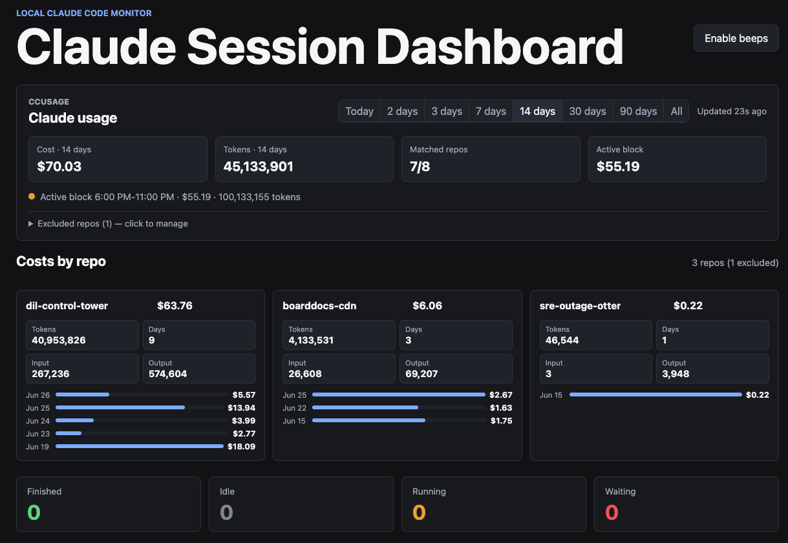
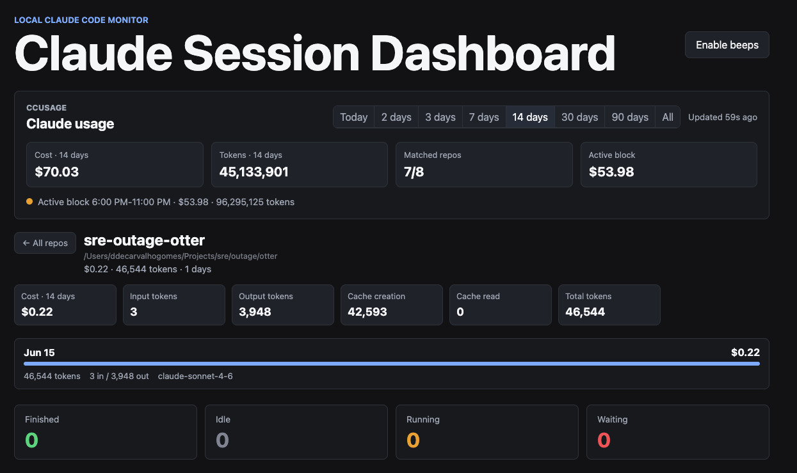

# Claude Status Dashboard

> **Real-time visibility into your Claude Code sessions — costs, statuses, and history at a glance.**

[](https://github.com/danielcg-net/claude_status_dashboard)
[](LICENSE)

Local-only web dashboard for tracking Claude Code sessions. Claude Code hooks register sessions and push status changes to the API exposed by the Docker container. The dashboard also reads Claude Code usage through [`ccusage`](https://www.npmjs.com/package/ccusage) and displays cost/token totals when Claude logs are available.

---

## Screenshots

| Active Sessions | Usage & Cost Explorer | Repo Cost Explorer |
|:---:|:---:|:---:|
|  |  |  |

---

## Quick Start

**Prerequisites:** Docker, `git`, Claude Code CLI

### One-liner install

```bash
curl -fsSL https://raw.githubusercontent.com/danielcg-net/claude_status_dashboard/main/install.sh | bash
```

This clones the repo to `~/.claude-status-dashboard`, starts the Docker container, and installs the Claude Code plugin globally. Then skip to [Step 3](#step-3--start-a-claude-code-session) below.

> To install to a custom directory: `CLAUDE_DASHBOARD_DIR=/your/path bash <(curl -fsSL ...)`

---

### Manual setup

### Step 1 — Start the dashboard

```bash
git clone https://github.com/danielcg-net/claude_status_dashboard.git
cd claude_status_dashboard
docker compose up --build -d
```

Open [http://localhost:8787](http://localhost:8787). You'll see an empty dashboard — that's expected until the hook is wired up.

### Step 2 — Install the Claude Code plugin

The plugin auto-reports every Claude Code session to the dashboard. Install it globally once and all your repos will show up:

```bash
claude plugin marketplace add danielcg-net/claude_status_dashboard --scope user
claude plugin install claude-status-dashboard@claude-status-dashboard --scope user
```

Verify it's installed:

```bash
claude plugin list
```

### Step 3 — Start a Claude Code session

Open any project with Claude Code. Within seconds a session card should appear on the dashboard at [http://localhost:8787](http://localhost:8787).

That's it. Every Claude Code session across all your repos will now report in automatically.

---

## How It Works

```
Claude Code  →  hook script  →  POST /api/sessions  →  Dashboard
                                                          ↕
                                              ccusage reads ~/.claude logs
                                              and shows cost & token totals
```

- **Hooks** fire on every Claude Code lifecycle event and push status to the dashboard API
- **ccusage** reads your local `~/.claude/projects/` logs to compute per-session costs
- **State is in-memory** — restarting the container clears the session cards (costs from ccusage are unaffected)

---

## Session Statuses

| Color | Meaning |
|:---:|:---|
| 🟢 **Green** | Claude finished running |
| 🟡 **Yellow** | Idle — waiting for your input |
| 🟠 **Orange** | Actively thinking or using tools |
| 🔴 **Red** | Paused — needs your approval or attention |

---

## Alternative: Manual Hook Setup

If you prefer not to use the plugin, you can wire up the hook script directly.

**1. Make the hook executable:**

```bash
chmod +x /path/to/claude_status_dashboard/hooks/claude-status-dashboard.sh
```

**2. Add the hooks to `~/.claude/settings.json`:**

Copy the contents of [`hooks/settings.global.example.json`](hooks/settings.global.example.json) into the `hooks` key of your `~/.claude/settings.json`, replacing `{{REPO_ROOT}}` with the absolute path where you cloned this repo.

For example, if cloned to `/home/user/claude_status_dashboard`:

```json
"command": "bash /home/user/claude_status_dashboard/hooks/claude-status-dashboard.sh"
```

---

## Configuration

### Dashboard container

Set these in `compose.yml` under `environment`:

| Variable | Default | Description |
|---|---|---|
| `CLAUDE_CONFIG_DIR` | `/claude` | Path to mounted Claude logs inside the container |
| `USAGE_CACHE_TTL_MS` | `30000` | How often to refresh ccusage data (ms) |
| `RED_ALERT_AFTER_MS` | `300000` | How long a red card stays before beeping |
| `PORT` | `8787` | HTTP port |

By default, Compose mounts `~/.claude` into the container as read-only:

```yaml
volumes:
  - "${HOME}/.claude:/claude:ro"
environment:
  CLAUDE_CONFIG_DIR: "/claude"
```

If your Claude logs live elsewhere, update the volume source and `CLAUDE_CONFIG_DIR` accordingly.

> **Linux note:** If you run Docker with `sudo`, `${HOME}` resolves to `/root`
> instead of your user's home directory, so the volume mount points at the wrong
> path. Fix: add your user to the `docker` group (`sudo usermod -aG docker $USER`,
> then log out and back in) so you can run Docker without `sudo`.

### Hook environment variables

Optional — the hook works without any of these:

| Variable | Default | Description |
|---|---|---|
| `CLAUDE_STATUS_API_URL` | `http://localhost:8787` | Dashboard API base URL |
| `CLAUDE_STATUS_CURL_TIMEOUT` | `2` | Seconds before giving up on the API call |
| `CLAUDE_STATUS_USAGE_PROJECT` | _(auto-detected)_ | Override the ccusage project key for this repo |

The hook auto-detects the ccusage project key by walking up to the nearest Git root, so `CLAUDE_STATUS_USAGE_PROJECT` is rarely needed.

---

## Red Alert Beeps

The browser emits a quiet beep when any card stays **red** longer than `RED_ALERT_AFTER_MS`.

Browsers require a user gesture before audio plays — click **Enable beeps** after opening the page.

The page also stores these controls in the browser:

- **Start after** — seconds a card must stay red before beeping
- **Stop after** — number of beeps before stopping (blank = no limit)

---

## Updating the Plugin

After pulling new changes, reinstall the plugin to pick up the latest hook script:

```bash
claude plugin uninstall claude-status-dashboard --scope user
claude plugin install claude-status-dashboard@claude-status-dashboard --scope user
```

---

## Local Development

```bash
npm install
npm run dev
```

Open [http://localhost:8787](http://localhost:8787).

---

## API Reference

<details>
<summary>View API endpoints</summary>

### Read ccusage totals

```bash
curl http://localhost:8787/api/usage
```

### Register or update a session

```bash
curl -X POST http://localhost:8787/api/sessions \
  -H 'Content-Type: application/json' \
  -d '{"id":"repo-main","name":"My project","usageProject":"my-project","status":"orange","detail":"Claude is running tests"}'
```

### Update a session status

```bash
curl -X PATCH http://localhost:8787/api/sessions/repo-main \
  -H 'Content-Type: application/json' \
  -d '{"status":"red","detail":"Waiting for tool approval"}'
```

### List sessions

```bash
curl http://localhost:8787/api/sessions
```

### Delete a session

```bash
curl -X DELETE http://localhost:8787/api/sessions/repo-main
```

> **`usageProject`** links the session card to a ccusage project for cost display. If omitted, the dashboard tries to match by session `id` or `name`. To find your project keys:
> ```bash
> npx ccusage claude daily --instances --json
> ```

</details>

---

## Repository

Published at [danielcg-net/claude_status_dashboard](https://github.com/danielcg-net/claude_status_dashboard).
